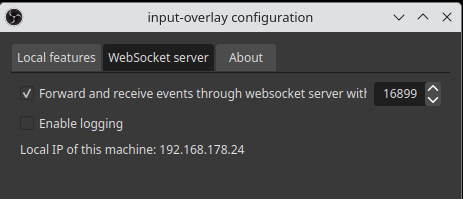
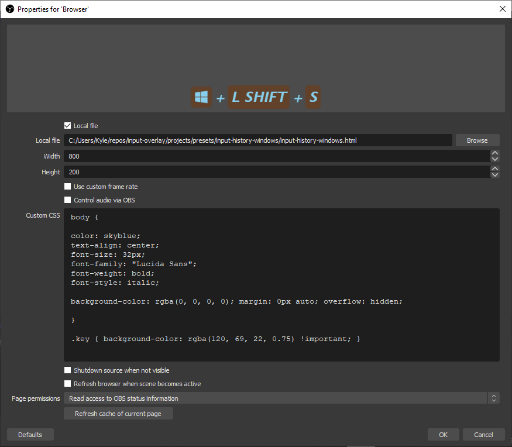

# input-history-windows-keyboard
By: [@christiankyle-ching](https://github.com/christiankyle-ching)

A simple input-history HTML file that can be used with browser source. **Currently only shows keyboard events.**

## How to Use?

1. [Download the HTML file](input-history-windows.html).
2. Add a **Browser Source**.
3. Check **Local File**, then **locate the downloaded HTML file**.
4. **Adjust width and height** relative to your scene's pixel size.
5. (Optional) Customize using **by editing the HTML directly (recommended)** or **Custom CSS**. 

**Make sure that forwarding events to websocket is enabled.**



## Customization
**You must know basic [HTML](https://developer.mozilla.org/en-US/docs/Web/CSS), [CSS](https://developer.mozilla.org/en-US/docs/Web/CSS), and [JavaScript](https://developer.mozilla.org/en-US/docs/Web/JavaScript) to easily customize the template.**

### Basic Styling
In OBS, you can add styles in **Custom CSS** to override the styles in the HTML.

**But I recommend you to edit the HTML file directly instead, so the styling persists even after removing the browser source.**



In the example above:
- The `body { ... }` CSS selector: means that all the styles indicated inside the braces are applied to **the whole HTML `<body>`**.
  - `color: skyblue;` - Sets the font color to skyblue.
  - `text-align: center;` - Sets the text align (either left, center or right).
  - `font-size: 32px;` - Sets the font size in pixels. Adjust based on your screen pixel size.
  - `font-family: "Lucida Sans";` - Sets the font family. **Make sure the font is installed in your system, otherwise it won't work.**
  - `font-weight: bold;` - Sets text to bold.
  - `font-style: italic;` - Sets text to italic.
  - `background-color: rgba(0, 0, 0, 0);` - Represents red, green, blue, and alpha. Makes the browser's background transparent (which is what you mostly want in the scene).
- The `span.key, span.repeat { ... }` CSS selector: means that all the styles indicated inside the braces are applied to **all elements that has `class="key" or class="repeat" in HTML` (the rounded rectangle container for keys and round repetition counter)**.
  - Note the `!important` after the value of `background-color`. This is sometimes required to override the styles applied within the HTML, and to use this value instead.

### Hide Specific Keys
Just comment out the lines in `var KEYCODES = {...}` of keys you don't want to show. Just add `//` on beginning of the line to "comment" lines.

```js
// In HTML <script>
var KEYCODES = {
      /* Begin Virtual Key Codes */
      0x0001: ["VC_ESCAPE", "ESC"],

      // Begin Function Keys
      // 0x003b: ["VC_F1", "F1"], This key will be hidden
      0x003c: ["VC_F2", "F2"],

      ...
}
```

### Replace Keys with Icons
1. Get an SVG code of the icon and paste it inside `<div id="icons-container">`. (I used [FontAwesome](https://fontawesome.com/icons)).
2. Assign it an `id`.

```html
<!-- In HTML <body> -->

<!-- Windows Key - VC_META_L / VC_META_R -->
<svg id="SVG_VC_META">
    ...
</svg>
```

It's better to follow my naming convention for ease of use:
```
SVG_<KEYNAME>
```
Where `<KEYNAME>` can be found in `var KEYCODES = {...};`.

```js
// In HTML <script>
var KEYCODES = {
    ...
    // the KEYNAME is the first one, "VC_META"
    // "WIN" is an optional alias that will show if there are no icons set for 0x0e5b
    0x0e5b: ["VC_META_L", "WIN"],
}
```
3. Add it to the list of `var KEYICONS;`
```js
// In HTML <script>
var KEYICONS = {
    ...
    // replace "SVG_VC_META" is the id you assigned the <svg> in step 2
    0x0e5b: document.getElementById("SVG_VC_META"),
}
```

### Enable / Disable Timeout Fade
To enable / disable this feature:
```js
// In HTML <script>
var HISTORY_TIMEOUT_ACTIVE = true; // or false
```

To adjust timeout before a key combination fades out:
```js
// In HTML <script>
var HISTORY_TIMEOUT = 3500; // this is in milliseconds
```

To adjust the duration of fade animation:
```css
/* Animation for hide timeout */
p.key-combination.hidden {
    ...
    
    /* Change this value in HTML <style> */
    transition-duration: 1s;
}
```

### Adjust Line Height
Change the value of margin.
```css
p.key-combination > * {
    /* Change this value in HTML <style>*/
    margin-top: 0.5em;

    ...
}
```
In the example above, `0.5em` is `48px(body:font-size) * 0.5`. Think of it like percentage of the font-size.

### Customize the background of keys and repeat counters
As stated in the [Basic Styling](#basic-styling), use the `span.key, span.repeat` selector to select and style the container of the keys and repetition counters.

### Align to the top
If set to true, keys are top-aligned to the browser source and new keys are added at the top, instead of the bottom.
```js
var HISTORY_TOP_ALIGN = true;
```

### Change separator character
Change the character used in between keys.
```js
var SEPARATOR = "+"; // Change this value in HTML <script>
```

### Display only initial key press
To not display a key repeatedly while it's held:
```js
var ONLY_INITIAL_PRESS = true; // Default is false
```

### Repetition counter interval
To distinguish between quick consecutive repeated inputs and slow ones, there's a repeat timeout, after which the next repeated input is displayed as a new input and the repetition count is reset. Duration is set in milliseconds (e.g., 1500 = 1.5 seconds).
```js
var REPEAT_TIMEOUT = 1500;
```
